# Configuración de WhatsApp Business API

## 1. Cuenta de Meta Developer

Necesitas una cuenta activa en [Meta for Developers](https://developers.facebook.com/apps).

---

## 2. Crear una nueva App

1. **Detalles de la app** — Ingresa el nombre de la app y el correo de contacto.
   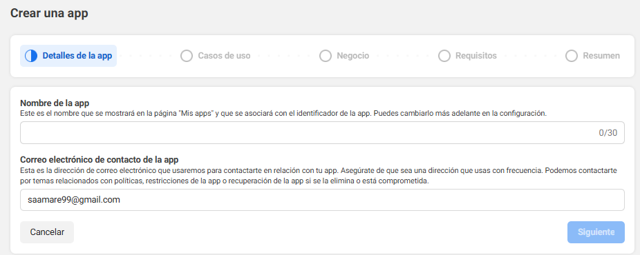
2. **Caso de uso** — Selecciona _"Conectarte con los clientes a través de WhatsApp"_.
   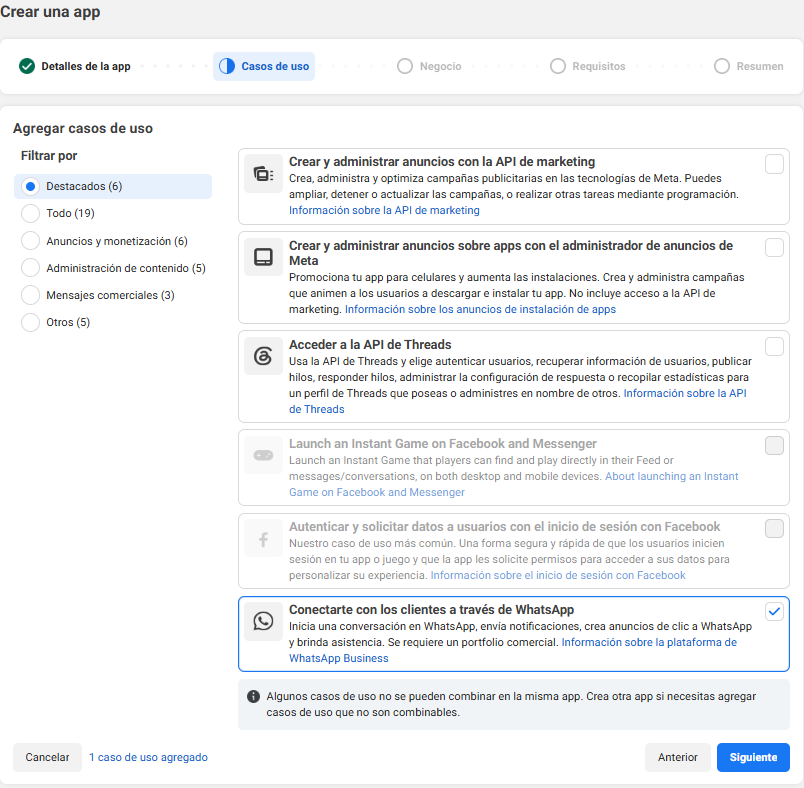
3. **Portafolio** — Crea uno nuevo o vincúlate a uno existente.
   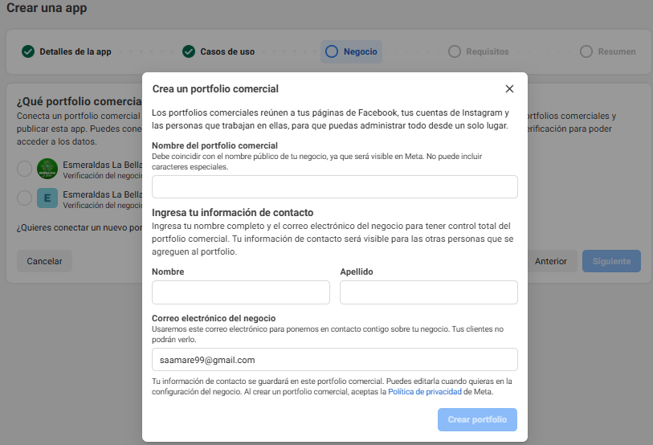
4. **Requisitos** — No se requiere ninguna configuración adicional.
   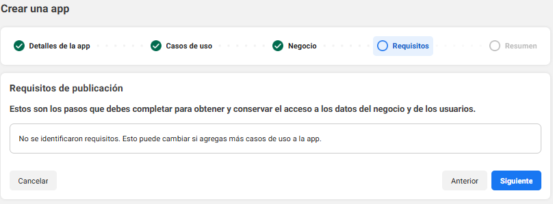

---

## 3. Configurar Webhooks

1. Dentro de la app, dirígete a **Webhooks**.
2. En _Seleccionar producto_, elige **WhatsApp Business Account**.
3. En **VS Code**, expone el puerto `3000` con vista pública para obtener una URL del tipo:
   ```
   https://dkbw9lx4-3000.use2.devtunnels.ms/
   ```
   Ingrésala como **URL de devolución de llamada**.
4. En **Token de verificación**, usa el valor de `WHATSAPP_TOKEN_WEBHOOKS` de tu archivo `.env`.
   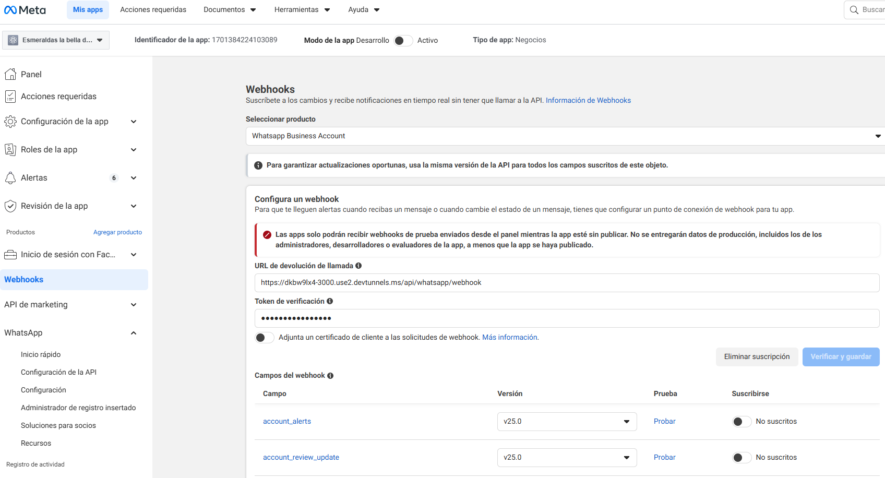
5. Prueba el campo `messages` en la versión **v23.0** y haz clic en **Suscribirse**.
   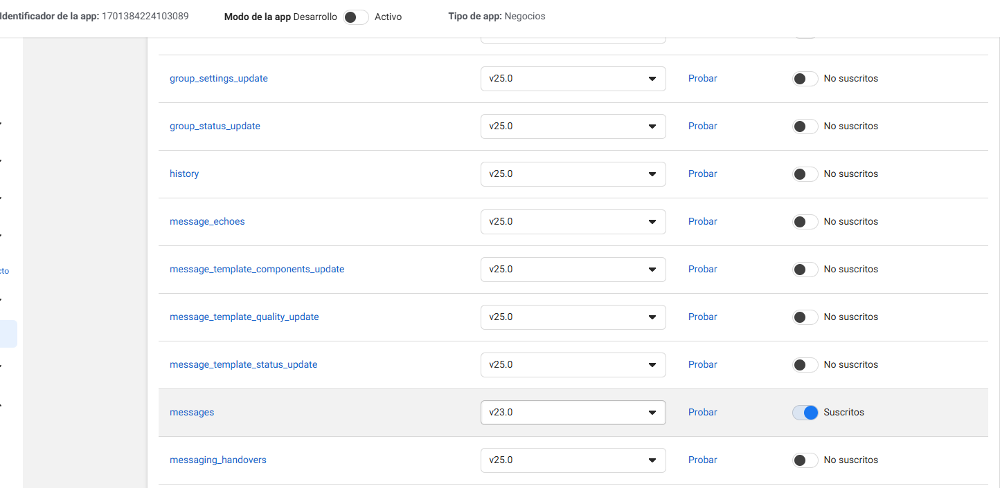
   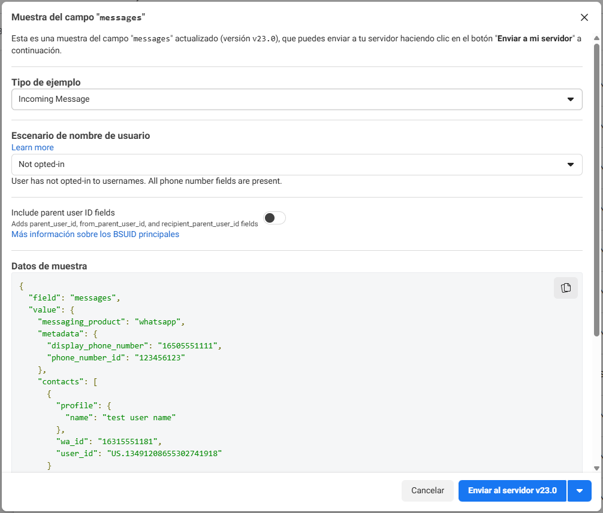

---

## 4. Configurar envío y recepción de mensajes

1. Ve a **WhatsApp → Configuración de la API → Generar token de acceso**.  
   Copia el token y asígnalo a `WHATSAPP_ACCESS_TOKEN` en tu `.env`.
2. Usa el **número de prueba** y copia el **Identificador de número de teléfono**.  
   Asígnalo a `WHATSAPP_PHONE_NUMBER_ID` en tu `.env`.
3. En _"Para"_, agrega tu número personal a la lista mediante **Administrar lista de números de teléfono**.
4. Realiza un envío de prueba para verificar que todo funciona.
   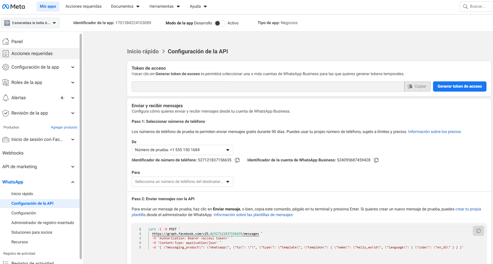
   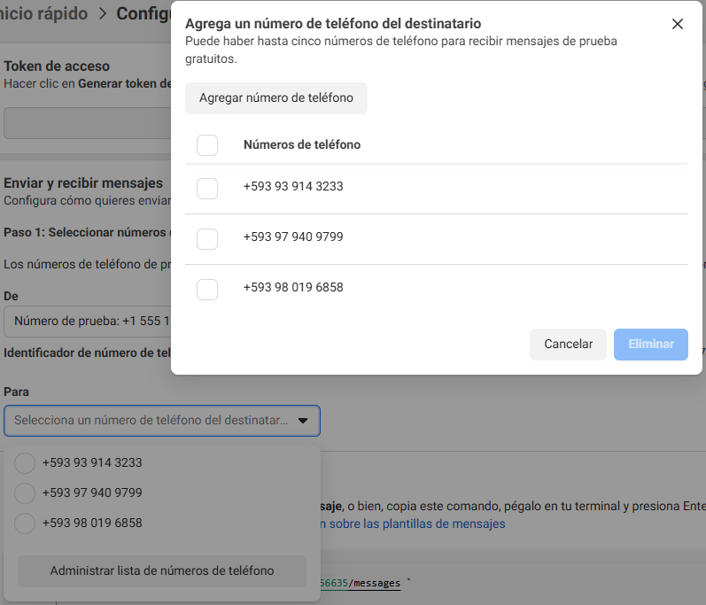

---

## 5. Configurar Flows en Business Manager

Accede a [business.facebook.com](https://business.facebook.com/) donde tienes tu portafolio.

1. Ve a **Cuentas → Cuentas de WhatsApp** y selecciona **Test WhatsApp Business Account**.
2. Haz clic en **Administrador de WhatsApp**.
   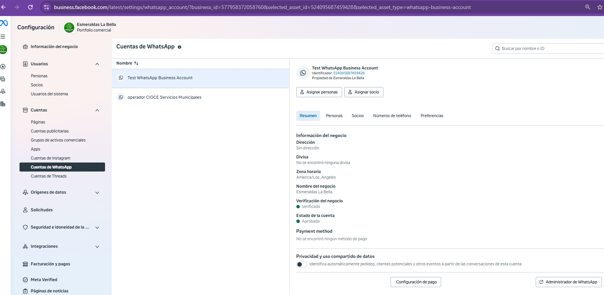
3. Ve a **Flows** y crea dos flows con las siguientes configuraciones:
   - **Categoría:** Encuesta
   - **Plantilla:** Sin punto de conexión (Predeterminada)
     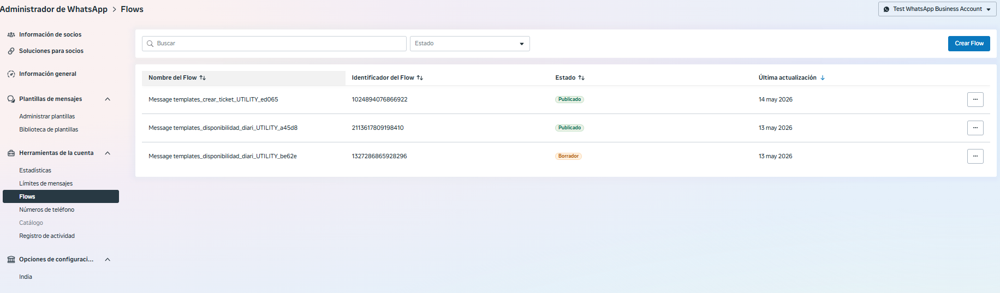
4. Edita cada flow y pega el contenido JSON correspondiente:
   - `docs/whatsapp-business/flows/template/DISPONIBILIDAD.json`
   - `docs/whatsapp-business/flows/template/TICKET_TECNICO.json`
     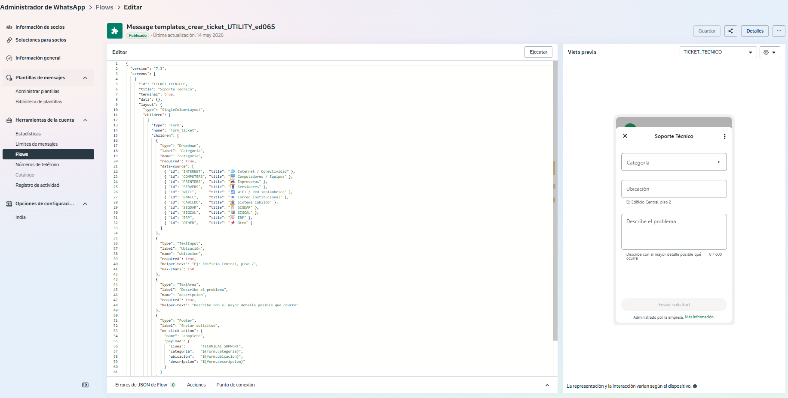
5. En **Plantillas de mensajes → Administrar plantillas de mensajes**, crea una plantilla que:
   - Llame al flow de **DISPONIBILIDAD**
   - **Sin variables**
   - Idioma: **Español**
   - > ⚠️ Esta plantilla no inicia una conversación nueva.
     > 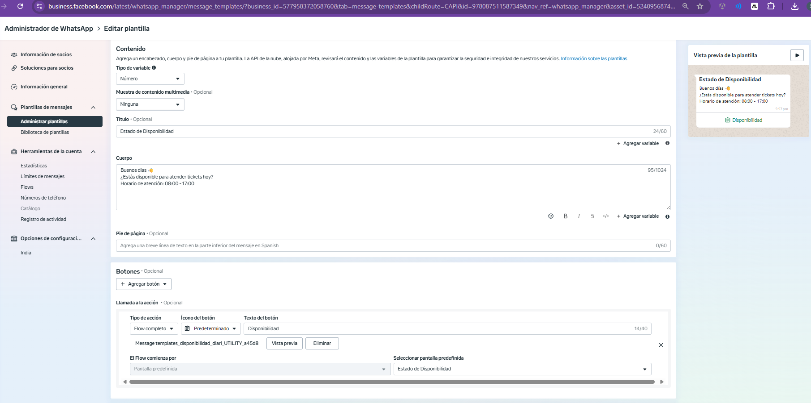
6. Copia el nombre de esa plantilla y asígnalo a `AVAILABILITY_TEMPLATE_NAME` en tu `.env`.

---

## Variables de entorno requeridas

| Variable                     | Descripción                                                |
| ---------------------------- | ---------------------------------------------------------- |
| `WHATSAPP_TOKEN_WEBHOOKS`    | Token de verificación del Webhook                          |
| `WHATSAPP_ACCESS_TOKEN`      | Token de acceso generado en la API                         |
| `WHATSAPP_PHONE_NUMBER_ID`   | Identificador del número de teléfono de prueba             |
| `AVAILABILITY_TEMPLATE_NAME` | Nombre de la plantilla que llama al flow de disponibilidad |
